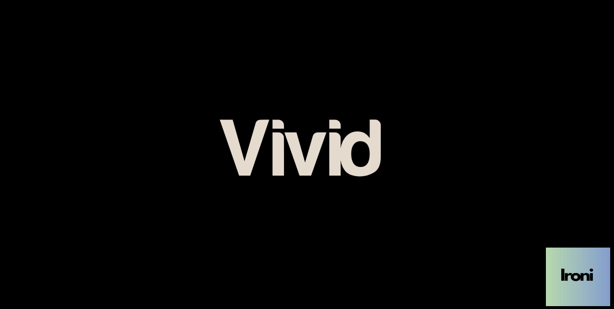

# Vivid

*A modern, modular 3D engine for creating immersive web experiences, powered by Three.js and WebXR.*

Vivid is a modern, modular 3D engine designed to bring real-time rendering and immersive experiences—such as games, virtual tours, and VR/AR applications—to the web. Built with simplicity and performance in mind, it makes it easy to create stunning 3D experiences that run directly in the browser.

## ✨ Features

- **Real-Time 3D Rendering**: High-performance graphics using Three.js, built on WebGL.
- **Camera Controls**: Intuitive navigation with mouse, touch, or keyboard inputs via OrbitControls.
- **Model Loading**: Import 3D assets with built-in GLTF support.
- **WebXR Integration**: Seamless VR and AR experiences on compatible devices.
- **Modular Design**: Extendable architecture for custom components and features.
- **No Framework Bloat**: Pure HTML, CSS, and JavaScript—no React or heavy libraries required.

## 🚀 Quick Start

### Local Development
1. **Clone the Repository**  
   ```bash
   git clone https://github.com/IroniCorp/Vivid.git
   cd Vivid
   ```

2. **Serve the Website**  
   Run a local server to view the project (required for module imports):
   ```bash
   npx http-server docs/
   ```
   Open `http://localhost:8080` in your browser.

3. **Explore Examples**  
   Check out the templates in `docs/examples/`:
   - `basic-cube/`: A simple rotating cube with lighting.
   - `vr-experience/`: A VR-ready scene using WebXR.

### Using Vivid in Your Project
1. Copy the `src/` folder to your project.
2. Include the engine in your HTML:
   ```html
   <script type="module">
     import { Vivid } from './src/core/Vivid.js';
     const engine = new Vivid(document.body);
     engine.start();
   </script>
   ```

## 📂 Project Structure

```
Vivid/
├── src/                   # Engine source code
│   ├── core/             # Core classes (Vivid.js, etc.)
│   ├── components/       # Reusable components
│   └── utils/           # Utilities (loaders, inputs)
├── docs/                 # Website files for GitHub Pages
│   ├── index.html       # Landing page with features and templates
│   ├── js/             # Copy of src/ for web serving
│   ├── assets/         # 3D models, textures, etc.
│   └── examples/       # Demo templates
├── README.md            # This file
└── LICENSE              # MIT License
```

## 🛠️ Development

- **Dependencies**: Only Three.js (loaded via CDN).
- **Build**: Manually copy `src/` to `docs/js/` before pushing to GitHub, or use a script:
  ```bash
  cp -r src/* docs/js/
  ```

## 🤝 Contributing

Contributions are welcome! Fork the repo, make your changes, and submit a pull request. See issues for feature ideas or bugs.

## 📜 License

Vivid is licensed under the [MIT License](LICENSE).

## 🌟 Acknowledgements

- [Three.js](https://threejs.org/) for an amazing 3D library.
- [WebXR](https://immersiveweb.dev/) for immersive web standards.
- Built with ❤️ by the IroniCorp team.

---
Star ⭐ this repository if you find it helpful!
